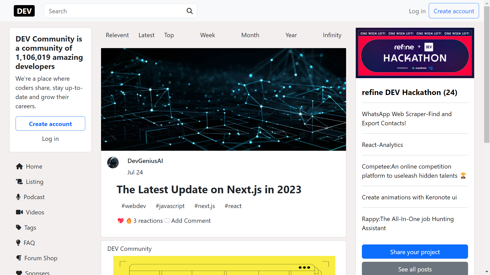
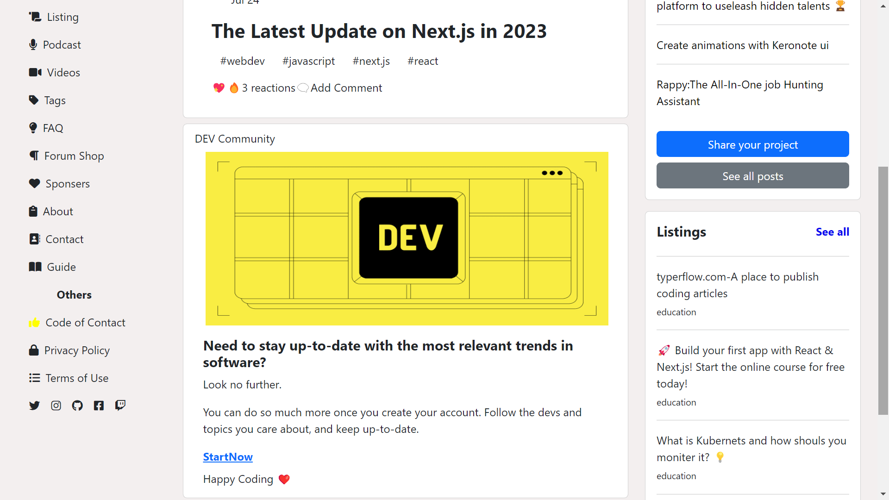

# Dev-Web-App : A react-based Homepage inspired by dev.to
## Command Used
**Use `cd frontend` to make frontend as current directory**
**Use `npm start` to run the app**
## Demo
**Experience ProfLink live here.**
[Live Demo](https://utkarshsinha121.github.io/Dev-Web-App/)
## Screenshots

